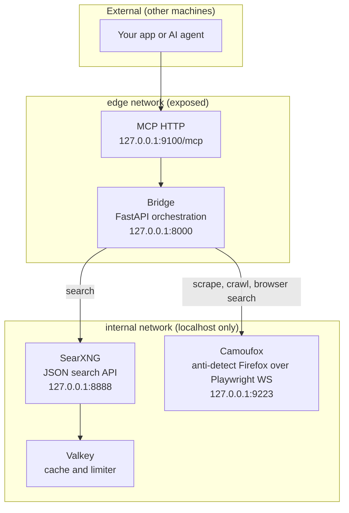
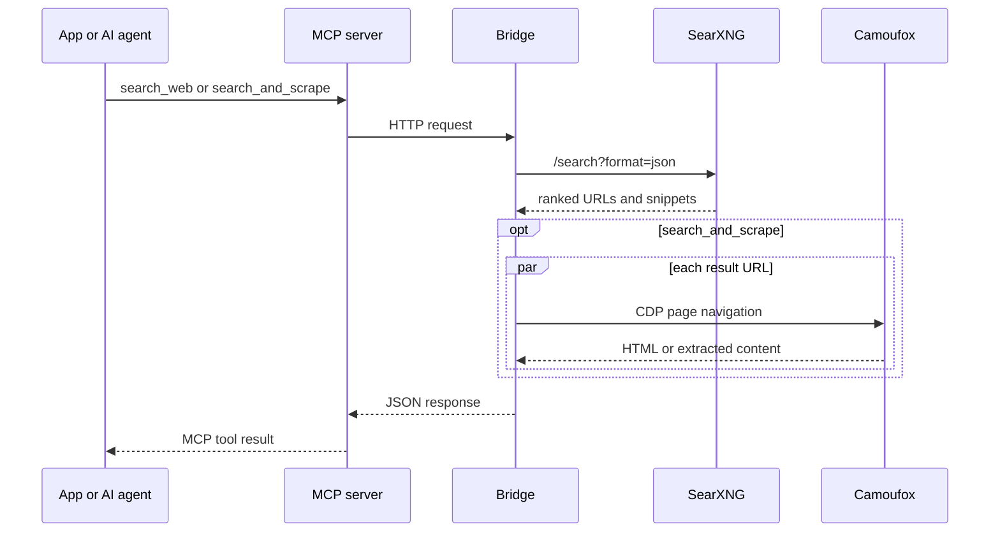

# Web Scrape Stack: [SearXNG](https://github.com/searxng/searxng) + [Camoufox](https://github.com/daijro/camoufox)

A self-hosted, Podman-based search-and-scrape stack that combines:

- **[SearXNG](https://github.com/searxng/searxng)** — privacy metasearch engine configured with a focused set of search engines, including Google, Bing, DuckDuckGo, Wikipedia, GitHub, Stack Overflow, Reddit, and news sources
- **[Camoufox](https://github.com/daijro/camoufox)** — anti-detect [Firefox](https://www.mozilla.org/firefox/) fork whose fingerprint patches live at the C++ level (not JS injection), serving stealth scraping over Playwright's websocket protocol
- **Bridge** — a [FastAPI](https://fastapi.tiangolo.com/) + [Model Context Protocol](https://modelcontextprotocol.io/) service that orchestrates both into a unified API (like [Exa](https://exa.ai/), but self-hosted and free)


## Quick Start

### Prerequisites

- [Podman](https://podman.io/) 4.x+ with `podman compose` (or [podman-compose](https://github.com/containers/podman-compose))
- ~2.5 GB RAM (SearXNG ~512 MB, Camoufox ~1 GB, Bridge ~128 MB)

```bash
make init && make up && make test
```

That's it — generates secrets, starts all services, and verifies everything works. Then point your AI agent at the MCP server (see [MCP Server](#mcp-server-for-ai-agents) below).

### Architecture



> **Security model:** Core services and MCP bind to `127.0.0.1` on the host by default. Set `MCP_BIND_HOST` to a non-loopback address only when remote access is intentional; a non-empty `MCP_API_KEY` is required in that mode. MCP is on the `edge` network only; it can talk to Bridge but cannot reach SearXNG, Camoufox, or Valkey directly.

### Request Flow



### Services

| Service    | Port (bind)  | Purpose                                      |
|------------|--------------|----------------------------------------------|
| [SearXNG](https://github.com/searxng/searxng) | 8888 (127.0.0.1) | Metasearch web UI + JSON API             |
| [Valkey](https://github.com/valkey-io/valkey) | —     | Redis-compatible cache for SearXNG           |
| [Camoufox](https://github.com/daijro/camoufox) | 9223 (127.0.0.1) | Anti-detect Firefox (Playwright WS endpoint) |
| Bridge     | 8000 (127.0.0.1) | Unified REST API ([FastAPI](https://fastapi.tiangolo.com/)) |
| MCP        | 9100 (127.0.0.1 by default) | Streamable HTTP server for AI agents ([MCP](https://modelcontextprotocol.io/)) |

Interactive API docs at `http://localhost:8000/docs`.

### Manual Testing (troubleshooting)

```bash
# Check all services
curl http://localhost:8000/health

# Search the web (SearXNG)
curl 'http://localhost:8000/search?q=podman+tutorial&max_results=3'

# Scrape a bot-protected page (stealth browser)
curl -X POST http://localhost:8000/scrape \
  -H 'Content-Type: application/json' \
  -d '{"url": "https://example.com", "mode": "extract"}'

# Search + scrape in one call (Exa-style)
curl -X POST http://localhost:8000/search_and_scrape \
  -H 'Content-Type: application/json' \
  -d '{"query": "rust async programming", "max_results": 3}'
```

## REST API

### `GET /search`

Search the web via the configured [SearXNG](https://github.com/searxng/searxng) engines.

| Parameter     | Type   | Default | Description                          |
|---------------|--------|---------|--------------------------------------|
| `q`           | string | —       | Search query (required)              |
| `categories`  | string | —       | Comma-separated: `general,it,images` |
| `language`    | string | `en`    | Language code                        |
| `pageno`      | int    | `1`     | Page number                          |
| `time_range`  | string | —       | `day`, `month`, or `year`            |
| `safesearch`  | int    | `0`     | 0=off, 1=moderate, 2=strict          |
| `max_results` | int    | `10`    | Truncate to N results                |

### `POST /scrape`

Scrape a single URL through the [Camoufox](https://github.com/daijro/camoufox) stealth browser. Bypasses [Cloudflare](https://www.cloudflare.com/), [DataDome](https://datadome.co/), [PerimeterX](https://www.perimeterx.com/), and [Akamai](https://www.akamai.com/).

```json
{"url": "https://protected-site.com", "mode": "extract"}
```

- `mode: "extract"` — clean markdown + tables (default)
- `mode: "fetch"` — raw HTML + text

### `POST /search_and_scrape`

Search via [SearXNG](https://github.com/searxng/searxng), then scrape each result URL through the stealth browser concurrently. This is the primary Exa-style endpoint.

```json
{"query": "best practices for kubernetes security", "max_results": 5, "scrape_mode": "extract"}
```

### `GET /crawl`

Crawl a whole website via the stealth browser (auto-handles SPA/JS + lazy-load).

| Parameter  | Type | Default | Description           |
|------------|------|---------|-----------------------|
| `url`      | str  | —       | Root URL (required)   |
| `depth`    | int  | `2`     | Crawl depth (1–5)     |
| `max_pages`| int  | `50`    | Max pages (1–200)     |

### `GET /web_search`

Web search through the stealth browser (real browser search, not SearXNG). Useful when SearXNG engines are rate-limited.

### `GET /health`

Check status of SearXNG and the Camoufox browser.

## MCP Server (for AI Agents)

The stack includes a dedicated MCP container (`ws-mcp`) that exposes the search and scrape tools over the [MCP](https://modelcontextprotocol.io/) Streamable HTTP transport on port 9100. It calls the bridge REST API internally — no local Python or modules required. [OpenCode](https://opencode.ai/), [Claude Desktop](https://claude.ai/download), [Cursor](https://www.cursor.com/), and any MCP-compatible client can connect to it as a remote MCP server.

### Add to opencode

Copy `opencode.jsonc.example` to `opencode.jsonc` (or merge into your existing config):

```jsonc
{
  "$schema": "https://opencode.ai/config.json",
  "mcp": {
    "web-scrape": {
      "type": "remote",
      "url": "http://localhost:9100/mcp",
      "enabled": true
    }
  }
}
```

For a **remote** connection (different machine), add the `Authorization` header:

```jsonc
{
  "mcp": {
    "web-scrape": {
      "type": "remote",
      "url": "http://YOUR_HOST:9100/mcp",
      "headers": {
        "Authorization": "Bearer YOUR_MCP_API_KEY"
      }
    }
  }
}
```

### Add to Claude Desktop

```json
{
  "mcpServers": {
    "web-scrape": {
      "url": "http://localhost:9100/mcp"
    }
  }
}
```

For a **remote** connection, include the token:

```json
{
  "mcpServers": {
    "web-scrape": {
      "url": "http://YOUR_HOST:9100/mcp",
      "headers": {
        "Authorization": "Bearer YOUR_MCP_API_KEY"
      }
    }
  }
}
```

> **Auth model:** Localhost (and podman-forwarded host connections) bypass auth automatically based on the container's trusted subnet. Remote clients must send `Authorization: Bearer <MCP_API_KEY>`. Set the key in `.env` (`MCP_API_KEY`) — `make init` generates one automatically.

### MCP Tools

| Tool                 | Description                                              |
|----------------------|----------------------------------------------------------|
| `search_web`         | Search via the configured [SearXNG](https://github.com/searxng/searxng) engines |
| `scrape_url`         | Scrape a URL via the [Camoufox](https://github.com/daijro/camoufox) stealth browser |
| `search_and_scrape`  | Search + scrape top results (Exa-style combined)         |
| `crawl_site`         | Crawl a whole site via the stealth browser |
| `browser_search`     | Web search via the stealth browser (not SearXNG) |
| `create_session`     | Create a named long-lived session (login persistence) |
| `delete_session`     | Close and forget a named session (drops its cookies) |
| `list_sessions`      | List live session names |

## Using Camoufox Directly (Playwright WS)

The `ws-camoufox` container exposes a Playwright websocket endpoint on host port 9223. You can connect your own [Playwright](https://playwright.dev/) automation directly — **your Playwright client must be the same minor version as the server (1.60.x)**, since Playwright's remote protocol rejects mismatched clients:

```python
from playwright.sync_api import sync_playwright

with sync_playwright() as p:
    browser = p.firefox.connect("ws://localhost:9223/browser")
    page = browser.new_page()
    page.goto("https://bot.sannysoft.com")
    page.screenshot(path="stealth-check.png")
```

```javascript
import { firefox } from "playwright";
const browser = await firefox.connect("ws://localhost:9223/browser");
const page = await browser.newPage();
await page.goto("https://bot.sannysoft.com");
await page.screenshot({ path: "stealth-check.png" });
```

### Named Sessions (login persistence)

By default every scrape runs in a throwaway isolated context — no cookies
carry over. When a target needs a login, create a **named session** once and
pass its name on subsequent calls; cookies and localStorage persist across
calls within that session:

```bash
# 1. Create the session
curl -s -X POST localhost:8000/sessions -H 'Content-Type: application/json' -d '{"name": "github"}'

# 2. Log in inside it (e.g. drive the login form via your own Playwright
#    client connected to ws://localhost:9223/browser, or scrape the login
#    endpoint with the session name) — cookies now live in the session.

# 3. Scrape authenticated pages with the same session
curl -s -X POST localhost:8000/scrape -H 'Content-Type: application/json' \
  -d '{"url": "https://github.com/settings/profile", "session": "github"}'

# 4. List / drop it when done
curl -s localhost:8000/sessions
curl -s -X DELETE localhost:8000/sessions/github
```

The MCP tools work the same way: `create_session` → pass `session: "github"`
to `scrape_url` / `search_and_scrape` / `crawl_site` → `list_sessions` /
`delete_session`. Caches are session-scoped (the same URL is fetched once per
session, not across sessions), sessions are bounded by
`CAMOUFOX_MAX_SESSIONS` (default 16), and all sessions die with the browser
connection — restart `ws-camoufox` and you start logged-out again.

## Configuration

### Environment Variables

| Variable                | Default                  | Description                          |
|-------------------------|--------------------------|--------------------------------------|
| `SEARXNG_SECRET_KEY`    | (auto-generated)         | SearXNG session encryption key       |
| `SEARXNG_CHANNEL`       | `2026.8.28-a30b2d474`   | SearXNG image tag (change deliberately when updating) |
| `SEARXNG_URL`           | `http://searxng:8080`    | SearXNG URL (container-internal)     |
| `SEARXNG_REQUEST_TIMEOUT` | `10`                   | Outgoing request timeout (s) per engine |
| `SEARXNG_MAX_REQUEST_TIMEOUT` | `15`              | Max allowed request timeout (s)     |
| `SEARXNG_BAN_TIME_ON_FAIL` | `5`                   | Engine ban duration (s) after a failed request |
| `SEARXNG_MAX_BAN_TIME_ON_FAIL` | `120`            | Upper cap on the engine ban (s)     |
| `SEARXNG_SUSPEND_TOO_MANY` | `180`                | How long an engine is suspended (s) after a 429 / rate-limit |
| `SEARXNG_FORCE_OWNERSHIP` | `true`                | Force SearXNG file ownership on start |
| `SEARXNG_UWSGI_THREADS` | `4`                    | SearXNG worker thread count          |
| `CAMOUFOX_WS_URL`       | `ws://camoufox:9222/browser` | Playwright websocket endpoint (container-internal) |
| `CAMOUFOX_SHM_SIZE`     | `1gb`                    | Browser shared memory size |
| `CAMOUFOX_NAV_DELAY`    | `400`                    | Post-navigation pause (ms) before extraction (crawl, SERP, and extract-mode pages; fetch mode skips it) |
| `BRIDGE_HOST`           | `0.0.0.0`                | Bridge listen address (internal container) |
| `BRIDGE_PORT`           | `8000`                   | Bridge listen port (internal container) |
| `BRIDGE_CACHE_TTL`      | `300`                    | Scrape cache TTL (s) — repeat scrapes of the same URL skip the browser |
| `BRIDGE_CACHE_MAX`      | `100`                    | Max pages held in the scrape cache |
| `BRIDGE_CACHE_MAX_BYTES` | `26214400`              | Max serialized scrape-cache size (25 MiB) |
| `CAMOUFOX_TIMEOUT`       | `60`                    | Browser navigation timeout (s) |
| `CAMOUFOX_NAV_WAIT`      | `domcontentloaded`      | Browser navigation wait condition |
| `CAMOUFOX_MAX_CONCURRENT_PAGES` | `3`              | Maximum concurrent browser pages |
| `CAMOUFOX_WAF_WAIT`      | `15`                    | Maximum WAF challenge wait (s) |
| `CAMOUFOX_ISOLATE_CONTEXTS` | `true`                | Isolate cookies/storage for each request |
| `CAMOUFOX_MAX_SESSIONS` | `16`                     | Max concurrent named sessions (login persistence) |
| `CRAWL_MAX_SECONDS`     | `1800`                   | Wall-clock budget per `/crawl` call (s); `0` = unlimited. Returns partial results when exhausted |
| `SSRF_DNS_CACHE_TTL`    | `60`                     | TTL (s) for cached SSRF DNS verdicts (`0` disables caching) |
| `LOG_LEVEL`             | `INFO`                   | Log level for the bridge and MCP services (`DEBUG`/`INFO`/`WARNING`/`ERROR`) |
| `PORT_CAMOUFOX`         | `9223`                   | Host (loopback) port for direct access to the ws-camoufox container |
| `BRIDGE_URL`            | `http://bridge:8000`     | Bridge URL used by MCP (container-internal) |
| `PORT_SEARXNG`          | `8888`                   | Host port for SearXNG                |
| `PORT_BRIDGE`           | `8000`                   | Host port for Bridge REST API        |
| `PORT_MCP`              | `9100`                   | Host port for MCP server             |
| `MCP_API_KEY`           | (auto-generated)         | Bearer token for remote MCP clients (localhost bypasses auth) |
| `MCP_BIND_HOST`         | `127.0.0.1`              | Host address published for MCP; non-loopback requires `MCP_API_KEY` |
| `MCP_TRUSTED_CIDRS`     | (auto-detected)          | Comma-separated CIDRs that bypass bearer auth; empty = loopback + container /24 subnets |
| `MCP_SESSION_TTL`       | `1800`                   | Idle MCP session lifetime (s) before expiry |
| `MCP_RATE_LIMIT`        | `120`                    | Max MCP requests/min per client IP (`0` = unlimited) |
| `MCP_MAX_BODY`          | `1048576`                | Max MCP request body size (bytes)    |
| `MCP_ALLOWED_ORIGIN`    | `localhost`              | CORS allow-list for browser clients. `localhost` allows loopback hosts on any port; otherwise comma-separated exact origins (`scheme://host:port` — a bare hostname never matches); `*` allows any origin (refused without `MCP_API_KEY`); empty disables CORS |
| `MCP_SNIPPET_CHARS`     | `300`                    | Search-result snippet length (chars) in MCP tool output |
| `MCP_CONTENT_CHARS`     | `5000`                   | Single-page scrape length (chars) in MCP tool output |
| `MCP_COMBINED_CHARS`    | `1200`                   | Per-result length (chars) in `search_and_scrape` MCP output |
| `APP_UID`               | `1000`                   | Host user UID for bridge/mcp containers |
| `APP_GID`               | `1000`                   | Host user GID for bridge/mcp containers |

### [SearXNG](https://docs.searxng.org/) Configuration

Settings are rendered from `searxng/settings.template.yml` at container start,
pulling the engine-tuning values above from `.env`. Edit the template to:
- Enable/disable specific search engines
- Change default language or safe search level
- Add outgoing proxies

The rate-limiting / engine-suspension knobs are exposed as environment
variables (see the table above) — e.g. to fail over faster after a 429:

```bash
# In .env
SEARXNG_SUSPEND_TOO_MANY=60
```

Apply changes: `podman compose up -d --force-recreate searxng` (or `make up`)

### Camoufox Locale and Profile

The browser inherits the compose process' `TZ` value (set `TZ` in `.env` to
override it) — consistent locale/timezone matters for fingerprint coherence.

The profile is **ephemeral by design**: Playwright's `launchServer` cannot serve
a persistent context over a websocket, so each container start gets a throwaway
profile (cookies/storage do not survive a restart). The bridge's default
per-request context isolation works the same way. For login persistence across
scrape calls, use **named sessions** (see the bridge `POST /sessions` API and the
`create_session`/`delete_session`/`list_sessions` MCP tools).

uBlock Origin ships inside the Camoufox browser build — no extension init
machinery needed.

`make up`, `make rebuild`, and `make update` run `make init` automatically. A
complete fresh setup is therefore:

```bash
rm -f .env
make clean
make update
```

### Browser engine: Camoufox (and why Fortress was removed)

The stack previously shipped **[Tilion Fortress](https://github.com/tiliondev/fortress)** (recompiled stealth Chromium over CDP). Upstream stopped shipping builds on 2026-07-15 (Chromium 150 vs current stable 151.x), so the unpatched browser was both a growing CVE liability and increasingly readable as outdated by version-database detectors. The last Fortress-based commit is tagged **`fortress-last`** (`git checkout fortress-last` to revisit it).

**[Camoufox](https://github.com/daijro/camoufox)** replaces it — an anti-detect Firefox fork whose fingerprint patches live at the C++ implementation level (same idea as Fortress, actively maintained, tracks current Firefox releases).

Upgrading from a Fortress-era stack? The old containers are no longer in the compose file, so `make down` can't remove them — clean them up once:

```bash
podman rm -f ws-fortress ws-ublock-init
podman volume rm web-scraping_fortress-profile
```

What to know:

- The `ws-camoufox` container pins the Camoufox package (0.5.5) **and** the browser build (`152.0.4-beta.29`) at image build time — nothing is downloaded at container start.
- **Playwright version parity is mandatory**: the bridge and the Camoufox image must run the same Playwright *minor* (the server rejects mismatched clients with HTTP 428). Both are pinned to 1.60.x because Camoufox 0.5.5 requires `playwright<1.61`. When Camoufox ships support for a newer Playwright, bump both pins together (see AGENTS.md).
- The browser is plain headless (`headless='virtual'`/Xvfb is not wired through Camoufox's server mode yet) and serves a **single browser instance with a fixed fingerprint**, with per-request context isolation.
- **No persistent profile in server mode**: Playwright's `launchServer` cannot serve a persistent context over a websocket, so cookies/storage do not survive a container restart. Use **named sessions** for login persistence across scrape calls.
- The websocket endpoint has no built-in token auth; it stays on the `internal` network and is published to `127.0.0.1:9223` only (loopback).
- uBlock Origin ships inside the Camoufox build (fetched with the browser at build time).
- Camoufox's remote-server mode is officially **experimental** upstream — it is nonetheless actively maintained and tracks current Firefox, which is exactly what Fortress stopped doing. If Camoufox ever stalls the way Fortress did, [Patchright](https://github.com/Kaliiiiiiiiii-Vinyzu/patchright) (patched Playwright driving real Chrome) is the smallest-change fallback, and [curl_cffi](https://github.com/lexiforest/curl_cffi) complements non-JS targets.

## Security

### Network segmentation

The stack is split into two bridge networks:

| Network   | Services                | Exposure                        |
|-----------|-------------------------|---------------------------------|
| `internal`| Valkey, SearXNG, Camoufox | `127.0.0.1` only (localhost)  |
| `edge`    | Bridge, MCP             | Bridge `127.0.0.1`, MCP `127.0.0.1` by default |

- **Core services** (SearXNG, Camoufox, Valkey) bind to `127.0.0.1` — accessible only from the host, not the LAN.
- **MCP** is published on localhost by default. Set `MCP_BIND_HOST` to a non-loopback address for remote clients; a non-empty `MCP_API_KEY` is mandatory then.
- MCP sits on `edge` only. It can talk to Bridge but **cannot** reach SearXNG, Camoufox, or Valkey directly — compromise of MCP does not expose the core services.

### Least privilege

- Bridge and MCP run as non-root (`appuser`).
- Valkey and SearXNG drop all capabilities except `SETGID`/`SETUID`/`CHOWN`.
- SearXNG is configured with `public_instance: false` and `limiter: false` (private, internal-only).

### MCP hardening

- **Idle session expiry** — MCP sessions are garbage-collected after `MCP_SESSION_TTL` seconds of inactivity (default 30 min), so abandoned client connections cannot leak memory or background tasks forever. A client `DELETE /mcp` frees the session immediately, and only `initialize` requests can create sessions — headerless non-initialize requests are rejected with `400` instead of piling up orphan transports.
- **Per-IP rate limiting** — `MCP_RATE_LIMIT` (default 120/min per IP) throttles abusive clients; excess requests get `429`. Set `0` to disable.
- **Request body limit** — requests larger than `MCP_MAX_BODY` (default 1 MB) are rejected with `413`.
- **Local-first authentication** — localhost clients may use the trusted local path. A non-loopback `MCP_BIND_HOST` requires a non-empty `MCP_API_KEY`; `make init` generates one.
- **Auth failures are logged** — every rejected request logs the client address, so "why can't my client connect" is answerable from `podman compose logs mcp`.
- **Log redaction** — tool arguments with embedded credentials (`user:pass@`, `?token=`, `?key=`...) are masked in logs.
- **Configurable CORS** — `MCP_ALLOWED_ORIGIN=localhost` allows browser clients from `localhost`, `127.0.0.1`, and `::1` on any port. Otherwise set a comma-separated list of exact origins (`scheme://host:port`, e.g. `http://myhost:8184` — a bare hostname never matches, since the browser's `Origin` header always includes the scheme), or `*` to reflect any origin. Empty disables CORS. Note that CORS **cannot be skipped for key-authenticated requests**: browser clients sending an `Authorization` header trigger a CORS preflight (`OPTIONS`), and the preflight never carries the key, so the server cannot distinguish authorized from unauthorized cross-origin calls at that point — the origin must be allowed either way. A "Failed to fetch" browser error with a working `curl` is the classic symptom of a CORS mismatch, not an auth failure. `*` is only honored when `MCP_API_KEY` is set: without a key, loopback and podman-forwarded clients bypass auth entirely, and wildcard CORS would let any website open in a browser call that unauthenticated endpoint. Debug with: `curl -i -X OPTIONS http://<host>:9100/mcp -H "Origin: <your-origin>" -H "Access-Control-Request-Method: POST" -H "Access-Control-Request-Headers: authorization,content-type"` and check for an `Access-Control-Allow-Origin` response header.
- **Request IDs** — every MCP request gets a short `req=...` log tag (also echoed in error bodies), and the bridge logs one per REST call with an `X-Request-ID` response header, so a failing agent call can be traced across the stack.
- **Known limitation: no TLS.** The MCP endpoint serves plain HTTP (a valid trusted certificate requires operational setup, which this project deliberately avoids). For exposure beyond a trusted LAN, terminate TLS in front of `:9100` with a reverse proxy (e.g. Caddy or Traefik with automatic HTTPS) and send the bearer token over that connection.

### SSRF protection

The bridge validates all URLs passed to `/scrape`, `/crawl`, and `/search_and_scrape` — requests to private/internal networks are rejected with `403`, and hosts that cannot be resolved at validation time are rejected outright. Browser redirects and subresource requests are checked again, while crawls remain same-origin and public-only.

### Project Structure

```
web-scraping/
├── Makefile                    # build, run, test targets
├── podman-compose.yml          # 5 services: valkey, searxng, camoufox, bridge, mcp
├── .env.example                # environment variable template
├── opencode.jsonc.example      # MCP config template (copy to opencode.jsonc)
├── scripts/
│   ├── doctor.sh               # make doctor — setup diagnostics
│   └── init.py                 # portable .env initialization
├── .github/workflows/ci.yml    # unit tests on every push
├── searxng/
│   ├── settings.template.yml   # SearXNG config template (focused engine set)
│   ├── render_settings.py      # renders template -> settings.yml from .env
│   └── limiter.toml            # rate limiter config
├── searxng-entrypoint.sh       # renders settings, then runs upstream entrypoint
├── camoufox/
│   ├── Dockerfile              # Python 3.12 + camoufox 0.5.5 + browser build (pinned)
│   └── launcher.py             # launches the Playwright websocket server
├── bridge/
│   ├── Dockerfile              # Python 3.12 + FastAPI + Playwright
│   ├── pyproject.toml          # dependencies
│   ├── tests/                  # unit tests (make test-unit / CI)
│   └── bridge/
│       ├── __init__.py
│       ├── main.py             # FastAPI REST API
│       ├── searxng_client.py   # SearXNG JSON API client
│       ├── browser_client.py   # Camoufox client (Playwright websocket)
│       └── ssrf.py             # shared SSRF guard (edge + browser-side)
└── mcp/
    ├── Dockerfile              # Python 3.12 + mcp + httpx (lightweight)
    ├── requirements.txt        # mcp, httpx, starlette, uvicorn
    ├── tests/                  # unit tests (make test-unit / CI)
    └── server.py               # Streamable HTTP MCP server (calls bridge REST API)
```

## Commands

### Makefile (recommended)

```bash
make init      # Create .env with UID/GID and secret key
make up        # Start all services
make build     # Build images
make test      # Unit + integration tests
make test-unit # Unit tests only (pytest inside bridge/mcp containers)
make test-scrape # Scrape smoke test through the bridge (example.com)
make doctor    # Diagnose common setup problems
make logs      # Follow logs
make rebuild   # Stop, rebuild, start
make update    # Pull latest images, rebuild custom images, restart
make down      # Stop services
make clean     # Stop, remove volumes, prune images
make help      # Show all targets (also runs with no argument)
```

### Podman Compose (manual)

```bash
# Start everything
podman compose up -d

# View logs
podman compose logs -f bridge
podman compose logs -f mcp
podman compose logs -f searxng
podman compose logs -f camoufox

# Stop
podman compose down

# Rebuild the bridge after code changes
podman compose up -d --build bridge

# Rebuild the MCP server after code changes
podman compose up -d --build mcp

# Update SearXNG
podman compose pull searxng && podman compose up -d searxng

# Rebuild the browser image after changing its pin
podman compose build camoufox && podman compose up -d camoufox
```

## How It Works

1. **Search**: The bridge sends a query to [SearXNG](https://github.com/searxng/searxng)'s `/search?format=json` endpoint. The configured engines return JSON with titles, URLs, and snippets.

2. **Scrape**: The bridge connects to [Camoufox](https://github.com/daijro/camoufox) over Playwright's websocket protocol (`ws://camoufox:9222/browser`). Camoufox is a patched [Firefox](https://www.mozilla.org/firefox/) fork that corrects the browser fingerprint at the C++ level (fonts, WebRTC, screen, navigator properties — not via detectable JS injection), so bot detectors ([Cloudflare](https://www.cloudflare.com/), [DataDome](https://datadome.co/), [PerimeterX](https://www.perimeterx.com/), [Akamai](https://www.akamai.com/)) read it as a normal Firefox install. The [Playwright](https://playwright.dev/) client drives the browser to fetch/extract pages.

3. **Search + Scrape**: The Exa-style combined endpoint searches via [SearXNG](https://github.com/searxng/searxng), then scrapes each result URL through the stealth browser concurrently — giving you search results with full page content in one call.

## Troubleshooting

### SearXNG returns 403 on JSON API

Ensure `json` is in the `search.formats` list in `searxng/settings.template.yml` (it is by default in this config). Recreate: `podman compose up -d --force-recreate searxng`.

### MCP client gets 401

The server logs each rejected request with the client address (`podman compose logs mcp`). Check that:
1. Your client sends `Authorization: Bearer <MCP_API_KEY>` (see `.env`).
2. The client isn't on a different subnet than the server — only localhost and the podman-forwarded subnet bypass auth.
3. `make init` was run, so the key isn't the placeholder.

### MCP client gets 429

Per-IP rate limit exceeded (`MCP_RATE_LIMIT`, default 120/min). Raise it in `.env` and recreate the mcp container, or check whether something is hammering the endpoint.

### MCP client gets "Session not found or expired"

Sessions are dropped after `MCP_SESSION_TTL` seconds of inactivity (default 30 min) or a server restart. MCP clients reconnect automatically with a new session — if yours doesn't, restart it or reduce the TTL.

### Correlating a failing call across logs

Both services tag requests with short IDs:
- bridge logs `req=abc12345 GET /search -> 502` and echoes `X-Request-ID: abc12345` in the response.
- mcp logs its own `req=...` per MCP request, and each bridge REST call it makes is logged as `bridge req=abc12345 GET /search` — that ID is the header the bridge receives.

Grep both services for the bridge-side ID to trace a failure: `podman compose logs bridge mcp | grep abc12345`.

### Scrape results look stale

The bridge caches scrape results for `BRIDGE_CACHE_TTL` (default 300 s, up to `BRIDGE_CACHE_MAX` pages) — a repeated scrape of the same URL within the TTL is served from memory and flagged with `"cached": true`. Set `BRIDGE_CACHE_TTL=0` and recreate the bridge to disable caching.

### Camoufox container won't start

The image build downloads the browser build (~1.2 GB) at build time — first `make build` takes a while. Check: `podman compose logs camoufox`. If the server log shows `Websocket endpoint: ws://0.0.0.0:9222/browser`, the browser is up.

### Scraping still blocked

Remaining blocks are commonly caused by target-site policy or IP reputation. The stack does not provide a proxy or CAPTCHA-solver integration; configure those outside this project if required.

### Bridge can't connect to Camoufox

Check the container is healthy: `podman ps` (ws-camoufox should be `healthy`) and `podman logs ws-camoufox` (expect `Websocket endpoint: ws://0.0.0.0:9222/browser`). The bridge health probe is a plain TCP connect to the websocket port; `curl http://localhost:8000/health` shows the browser status. Also confirm your Playwright client minor version matches the server's (1.60.x) — mismatched clients are rejected with HTTP 428.

### Port conflicts

Change the host port mappings in `podman-compose.yml`:
```yaml
ports:
  - "9088:8080"   # SearXNG
  - "9224:9222"   # Camoufox
  - "9000:8000"   # Bridge
```

## License

This stack combines:
- **SearXNG** — AGPL-3.0
- **Camoufox** — MPL-2.0
- **Bridge + MCP** (this repo's own code) — MIT, see [LICENSE](LICENSE)

Historical note: the original engine, [Tilion Fortress](https://github.com/tiliondev/fortress) (BSD-3-Clause), shipped through commit tag `fortress-last`.
