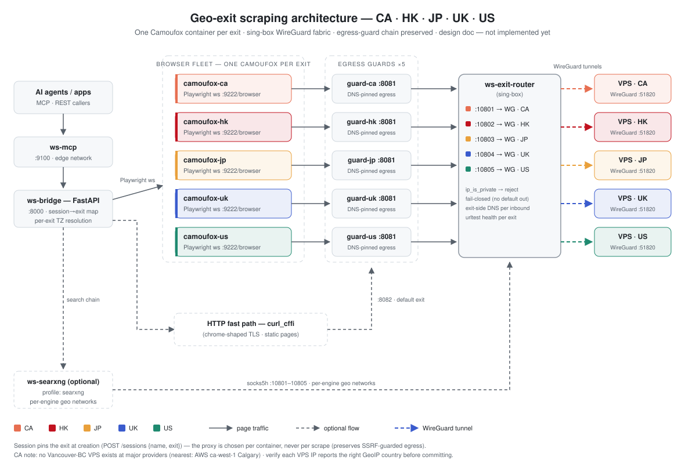
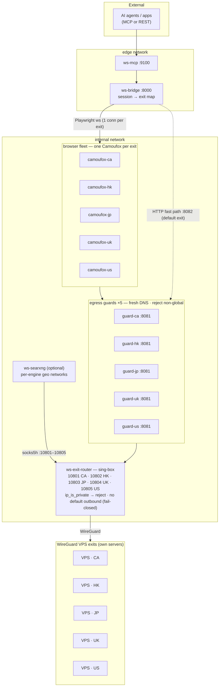
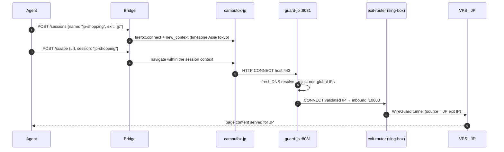

# Geo-Distributed Exits: CA · HK · JP · UK · US

> **Status: research & design only — nothing in this document is implemented yet.**
> Written 2026-10 from a three-track research effort (browser layer, proxy fabric, SearXNG/exit
> sourcing) plus a GitHub prior-art survey. Target exit set: **CA, HK, JP, UK, US** (one WireGuard
> exit per country, extensible to N exits per country).

## 1. Goals and chosen constraints

| Dimension | Decision |
|---|---|
| Exits | 5 countries: **CA, HK, JP, UK, US**, self-hosted **WireGuard on our own VPSes** (exclusive IPs; HK×N trivially added later) |
| Geo target | **Search-result geo + IP-gated pages** (country-specific SERPs, region-locked pages keyed on connecting IP). Not streaming-grade geo-unblocking |
| Concurrency | ~5–10 named sessions (1–2 per exit) on one Linux host |
| Platform | Podman Compose, Linux servers, open-source tooling only |
| Non-negotiables | Keep the stack's SSRF-guarded egress chain, Camoufox-only browser engine, proxy-at-container-start model (see `AGENTS.md` design decisions) |

## 2. Prior art: does something like this already exist on GitHub?

Short answer: **no single repo combines all the pieces; every individual piece is well proven.**
(Survey date 2026-10-01; star counts as of that date.)

### Closest whole-stack analogs (all miss something)

| Repo | What it covers | What it lacks vs. this design |
|---|---|---|
| [saifyxpro/HeadlessX](https://github.com/saifyxpro/HeadlessX) (~2.3k★) | Camoufox + REST API + MCP (`/mcp`) + search operators + Docker | No SearXNG metasearch (uses Tavily/Exa/Google), **no per-country exits**, no SSRF guard hop, no WG fabric |
| [Johell1NS/browser-search](https://github.com/Johell1NS/browser-search) (~528★) | Exactly SearXNG + Camoufox composed for AI agents | A skill bundle (scripts), **not an API/MCP service**; no geo exits, no SSRF guard, no fabric |
| [firecrawl/firecrawl](https://github.com/firecrawl/firecrawl) (~187k★) + [MCP server](https://github.com/firecrawl/firecrawl-mcp-server) | Search+scrape API + MCP at massive scale | Vanilla Playwright (no anti-detect), global proxy config only — **no per-exit geo** |
| [unclecode/crawl4ai](https://github.com/unclecode/crawl4ai) (~84.6k★), [D4Vinci/Scrapling](https://github.com/D4Vinci/Scrapling) (~84.8k★) | Scrape frameworks with MCP servers | No metasearch, no geo pinning, no egress guard |
| [microsoft/playwright-mcp](https://github.com/microsoft/playwright-mcp) (~37k★) | The reference browser MCP | Launch-time proxy only; no country pinning, no search API |
| [feder-cr/invisible_playwright_mcp](https://github.com/feder-cr/invisible_playwright_mcp) (~31.7k★) | Stealth Firefox MCP where TZ/locale follow a proxy | Per-**process** proxy (single instance), not per-session/per-exit; no search API, no farm |
| SaaS mirrors: [browserbase/mcp-server-browserbase](https://github.com/browserbase/mcp-server-browserbase) (archived), [brightdata/brightdata-mcp](https://github.com/brightdata/brightdata-mcp) | Per-session geo **as a paid SaaS** | Not self-hosted; not OSS end-to-end |

### Per-country exit routing — the biggest white space

- Compositional prior art only: [gluetun's official multiple-instance pattern](https://github.com/qdm12/gluetun-wiki/blob/main/setup/advanced/multiple-gluetun.md) (one VPN container per location), [windtf/wireproxy](https://github.com/windtf/wireproxy) (~5.8k★, userspace WG → SOCKS5 per peer), [SagerNet/sing-box](https://github.com/SagerNet/sing-box) (~38.5k★, multi-inbound + WireGuard endpoints + GeoIP rules), [MetaCubeX/mihomo](https://github.com/MetaCubeX/mihomo) (~34.5k★).
- [scrapoxy/scrapoxy](https://github.com/scrapoxy/scrapoxy) — the leading self-hosted proxy orchestrator (per-region proxy aggregation) — is **discontinued** (repo gutted, EOL page). The self-hosted geo-egress-orchestration niche is open.
- **No Camoufox farm orchestrator exists** (no repo runs N Camoufox containers with per-instance geo/proxy assignment). Camoufox-as-a-service repos exist — [jo-inc/camofox-browser](https://github.com/jo-inc/camofox-browser) (~11.3k★), [psyb0t/docker-stealthy-auto-browse](https://github.com/psyb0t/docker-stealthy-auto-browse), [nczz/BrowseForge](https://github.com/nczz/BrowseForge) — but none integrate metasearch or geo routing.
- SSRF-safe egress as a *connection-time proxy hop* has no notable dedicated repo (prior art is tiny in-process libraries) — the existing `ws-egress-guard` design has effectively no competitor.

**Positioning: "integration novel, components proven."** This design composes proven components
(camoufox, sing-box, gluetun/wireproxy patterns, SearXNG networks, MCP) into a combination that
does not exist on GitHub today — most notably per-country exit pinning with anti-detect browsers.

## 3. Current architecture (what we build on)

- One `ws-camoufox` container; browser-wide proxy at container start via `CAMOUFOX_PROXY_*`
  ([camoufox/launcher.py](../camoufox/launcher.py)); Compose pins it to the guard
  (`CAMOUFOX_PROXY_SERVER=http://egress-guard:8081`, [podman-compose.yml](../podman-compose.yml)).
- `ws-egress-guard` resolves every destination freshly, rejects non-global IPs, and forwards the
  validated IP to an optional upstream proxy — one upstream per port (8081 browser / 8082 fast
  path) ([bridge/bridge/egress_guard.py](../bridge/bridge/egress_guard.py)).
- Bridge connects to a single Playwright WS endpoint
  (`CAMOUFOX_WS_URL`, [bridge/bridge/browser_client.py](../bridge/bridge/browser_client.py));
  named sessions are contexts inside that one browser; context timezone is derived once through
  the proxy via ip-api.
- SearXNG (optional) renders an outgoing-proxy block from env
  ([searxng/settings.template.yml](../searxng/settings.template.yml)).

## 4. Key research findings

### 4.1 Browser layer — one Camoufox per exit (not per-context proxies)

- Camoufox computes its **entire fingerprint identity at launch, browser-wide**: it resolves the
  exit IP *through the proxy*, then spoofs timezone/locale/lat-lon/WebRTC IP from the GeoIP DB
  ([geoip docs](https://camoufox.com/python/geoip/),
  [geolocation.py](https://github.com/daijro/camoufox/blob/main/pythonlib/camoufox/geolocation.py)).
  There is **no per-context/per-session proxy or identity API** — the proxy is a launch-time
  option ([utils.py](https://github.com/daijro/camoufox/blob/main/pythonlib/camoufox/utils.py)).
  A proxy without geoip triggers a non-ignorable `LeakWarning` upstream.
- Playwright **does** support per-context proxies on Firefox, including over `connect()` to a
  remote `launchServer` ([network docs](https://playwright.dev/docs/network#http-proxy)). Rejected
  anyway: 5 exits would share one launch-time fingerprint (IP↔fingerprint incoherence), and the
  Bridge would have to re-implement per-context locale/timezone/geo while losing Camoufox's
  C++-level WebRTC/font coherence.
- Upstream's own scale guidance: *"Because servers only use one browser instance, fingerprints
  will not rotate between sessions. If you plan on using Camoufox at scale, consider rotating the
  server between sessions"* ([remote-server docs](https://camoufox.com/python/remote-server/)).
- `geoip` accepts an **explicit IP** (`geoip="<exit-ip>"`) which skips the launch-time IP lookup —
  a determinism knob worth exposing as `CAMOUFOX_GEOIP_IP` per container.
- Operational: per-container `shm_size` (already set), add `init: true` (zombie reaping —
  [Playwright docker docs](https://playwright.dev/python/docs/docker)), keep loopback-only WS
  bindings, keep Playwright 1.62.x client/server minor parity. Budget ~1–2 GB/container.

### 4.2 Proxy fabric — sing-box (one unprivileged container)

Of the compared options (sing-box, gluetun ×5, gost, dante, 3proxy, xray-core, host-level
wg-quick+netns), **sing-box** is the only single-container fabric that:

- terminates **WireGuard natively in userspace** — no `NET_ADMIN`, no `/dev/net/tun`
  (`wireguard` endpoint since 1.11.0,
  [endpoint docs](https://sing-box.sagernet.org/configuration/endpoint/wireguard/));
- exposes **SOCKS5 + HTTP on one `mixed` inbound per exit**
  ([mixed inbound](https://sing-box.sagernet.org/configuration/inbound/mixed/));
- routes **inbound → outbound statically**; with **no `route.final`** a dead tunnel fails closed,
  never leaks ([route docs](https://sing-box.sagernet.org/configuration/route/));
- does **per-inbound exit-side DNS** (DNS rule matched on `inbound`, server `detour` through the
  tunnel — [DNS rules](https://sing-box.sagernet.org/configuration/dns/rule/));
- offers `ip_is_private → reject` (evaluated on the resolved IP — catches exit-side-resolved
  private IPs too) and `urltest` health probes per exit;
- is GPLv3+, very active (v1.14.x, ~38.5k★).

Runner-up: **gluetun-per-exit** (MIT, kernel iptables kill-switch per container, OpenVPN support)
if provider-managed tunnels are ever needed; it costs 5 privileged containers (`NET_ADMIN` +
`/dev/net/tun`). **gost** fits only when upstreams are already SOCKS5 (no WG termination).
Host-level wg-quick + netns is max-isolation/max-throughput but breaks the Compose lifecycle.

### 4.3 DNS-for-geo (scoped to search-geo + IP-gated pages)

- **Request-time geo** (what gates IP-restricted pages) is decided by the **connecting IP** — the
  exit IP — and works regardless of DNS ([CloudFront viewer headers](https://docs.aws.amazon.com/AmazonCloudFront/latest/DeveloperGuide/adding-cloudfront-headers.md),
  [Fastly client.geo](https://www.fastly.com/documentation/reference/vcl/variables/geolocation/)).
- **DNS-level geo** (GeoDNS/CDN edge selection, e.g. Route 53 geolocation + EDNS Client Subnet —
  [AWS docs](https://docs.aws.amazon.com/Route53/latest/DeveloperGuide/routing-policy-geo.md),
  [RFC 7871](https://www.rfc-editor.org/info/rfc7871)) depends on the **resolver's** location.
  The guard resolves locally today, so Phase 1 fully covers search-geo + IP-gated pages; if a
  service's content ever differs by resolver region, the Phase-2 guard tweak is to forward
  hostnames (socks5h-style) and let sing-box resolve exit-side (the `ip_is_private → reject` rule
  still closes the rebinding window).
- Python SOCKS clients (httpx/httpcore, aiohttp-socks `rdns`, PySocks) and curl (`socks5h://`)
  default to **remote DNS**; the only component that can break exit-side DNS is the guard itself
  (it pre-resolves by design).

### 4.4 SearXNG per-geo search (when enabled)

- One instance + named proxy **networks** is fully supported (since Aug 2023,
  [PR #2685](https://github.com/searxng/searxng/pull/2685)): `outgoing.networks.<name>` defines a
  proxy group; engines pin to it via `network: <name>`
  ([outgoing docs](https://docs.searxng.org/admin/settings/settings_outgoing.html)). `socks5h://`
  gives proxy-side DNS (explicitly documented). Multiple proxies in one network round-robin —
  that is also the scaling path for a second HK/US exit later.
- Per-query `region` maps to engine params (Google `cr/gl/lr`, Bing `mkt`, DDG `kl`) — necessary
  but **not sufficient**: some engines geo-key off IP regardless
  ([brave.py sets a country cookie "because useLocation is IP based"](https://github.com/searxng/searxng/blob/master/searx/engines/brave.py)).
  Pairing region params with matching-exit IPs per engine is the robust design.
- Prefer one instance + networks over N instances: one config (fits the env-rendered template),
  one valkey/limiter, native result merging. Split per-geo only if engine bans correlate across
  engines pinned to one exit.

## 5. Target architecture



Component view (Mermaid, rendered on GitHub):



Session-scoped request flow (example: a JP-pinned session):



### Exit / port / timezone map

| Inbound (sing-box) | Exit id | Camoufox container | Guard container | Expected TZ (geoip-derived) |
|---|---|---|---|---|
| :10801 | `ca` | `ws-camoufox-ca` | `ws-egress-guard-ca` | America/Vancouver (America/Edmonton if Calgary VPS) |
| :10802 | `hk` | `ws-camoufox-hk` | `ws-egress-guard-hk` | Asia/Hong_Kong |
| :10803 | `jp` | `ws-camoufox-jp` | `ws-egress-guard-jp` | Asia/Tokyo |
| :10804 | `uk` | `ws-camoufox-uk` | `ws-egress-guard-uk` | Europe/London |
| :10805 | `us` | `ws-camoufox-us` | `ws-egress-guard-us` | America/Los_Angeles |

Timezone/locale/geo are derived automatically at each container's launch from its exit IP
(`CAMOUFOX_GEOIP=auto`); `CAMOUFOX_TIMEZONE` remains the manual override.

## 6. Component design

### 6.1 Exit fabric — `ws-exit-router` (sing-box)

One container, five `mixed` inbounds → five WireGuard endpoints (config sketch, 1.14.x syntax):

```jsonc
{
  "dns": {
    "servers": [
      { "type": "udp", "tag": "dns-ca", "server": "1.1.1.1", "detour": "wg-ca" },
      { "type": "udp", "tag": "dns-hk", "server": "1.1.1.1", "detour": "wg-hk" },
      { "type": "udp", "tag": "dns-jp", "server": "1.1.1.1", "detour": "wg-jp" },
      { "type": "udp", "tag": "dns-uk", "server": "1.1.1.1", "detour": "wg-uk" },
      { "type": "udp", "tag": "dns-us", "server": "1.1.1.1", "detour": "wg-us" }
    ],
    "rules": [
      { "inbound": ["in-ca"], "action": "route", "server": "dns-ca" },
      { "inbound": ["in-hk"], "action": "route", "server": "dns-hk" },
      { "inbound": ["in-jp"], "action": "route", "server": "dns-jp" },
      { "inbound": ["in-uk"], "action": "route", "server": "dns-uk" },
      { "inbound": ["in-us"], "action": "route", "server": "dns-us" }
    ]
  },
  "inbounds": [
    { "type": "mixed", "tag": "in-ca", "listen": "0.0.0.0", "listen_port": 10801 },
    { "type": "mixed", "tag": "in-hk", "listen": "0.0.0.0", "listen_port": 10802 },
    { "type": "mixed", "tag": "in-jp", "listen": "0.0.0.0", "listen_port": 10803 },
    { "type": "mixed", "tag": "in-uk", "listen": "0.0.0.0", "listen_port": 10804 },
    { "type": "mixed", "tag": "in-us", "listen": "0.0.0.0", "listen_port": 10805 }
  ],
  "endpoints": [
    { "type": "wireguard", "tag": "wg-ca", "address": ["10.8.1.2/32"], "private_key": "CA_PRIV",
      "peers": [{ "address": "CA_VPS_IP", "port": 51820, "public_key": "CA_PUB", "allowed_ips": ["0.0.0.0/0", "::/0"] }] },
    { "type": "wireguard", "tag": "wg-hk", "address": ["10.8.2.2/32"], "private_key": "HK_PRIV",
      "peers": [{ "address": "HK_VPS_IP", "port": 51820, "public_key": "HK_PUB", "allowed_ips": ["0.0.0.0/0", "::/0"] }] },
    { "type": "wireguard", "tag": "wg-jp", "address": ["10.8.3.2/32"], "private_key": "JP_PRIV",
      "peers": [{ "address": "JP_VPS_IP", "port": 51820, "public_key": "JP_PUB", "allowed_ips": ["0.0.0.0/0", "::/0"] }] },
    { "type": "wireguard", "tag": "wg-uk", "address": ["10.8.4.2/32"], "private_key": "UK_PRIV",
      "peers": [{ "address": "UK_VPS_IP", "port": 51820, "public_key": "UK_PUB", "allowed_ips": ["0.0.0.0/0", "::/0"] }] },
    { "type": "wireguard", "tag": "wg-us", "address": ["10.8.5.2/32"], "private_key": "US_PRIV",
      "peers": [{ "address": "US_VPS_IP", "port": 51820, "public_key": "US_PUB", "allowed_ips": ["0.0.0.0/0", "::/0"] }] }
  ],
  "route": {
    "rules": [
      { "ip_is_private": true, "action": "reject" },
      { "inbound": ["in-ca"], "outbound": "wg-ca" },
      { "inbound": ["in-hk"], "outbound": "wg-hk" },
      { "inbound": ["in-jp"], "outbound": "wg-jp" },
      { "inbound": ["in-uk"], "outbound": "wg-uk" },
      { "inbound": ["in-us"], "outbound": "wg-us" }
    ],
    "default_domain_resolver": "dns-ca"
  }
}
```

Properties: no `route.final` → unmatched/dead-tunnel traffic **fails closed**; only WireGuard UDP
egresses the container; per-inbound DNS detours give exit-side resolution; keys come from `.env`
via a rendered config (same pattern as the SearXNG template — never commit secrets).

### 6.2 Egress guards — per-exit upstream, chain preserved

Two variants (both keep the SSRF-hop semantics of `AGENTS.md` decision #13):

- **(a) zero code change:** five lightweight guard containers (same `bridge` image,
  `command: python -m bridge.egress_guard`), each with `CAMOUFOX_PROXY_SERVER=socks5://ws-exit-router:1080X`.
- **(b) small change:** one guard process binding N (port, upstream) pairs from env — extend
  `main()` in [bridge/bridge/egress_guard.py](../bridge/bridge/egress_guard.py).

Variant (a) is the Phase-2 default; (b) is a tidy-up once the shape is proven.

### 6.3 Browser fleet — five `ws-camoufox-*` containers

Duplicate the existing service ×5 (same image + launcher). Per container: its own
`CAMOUFOX_PROXY_*` (pointing at its guard), its own loopback-published WS port (e.g. 9223–9227),
`init: true`, per-container `shm_size`/`mem_limit` (≈2 GB) /`pids_limit`. Optional new knob
`CAMOUFOX_GEOIP_IP` passes camoufox's `geoip="<ip>"` so launches are deterministic (no launch-time
IP-echo dependency). Everything else — geoip fingerprints, ephemeral profile, uBlock — unchanged.

### 6.4 Bridge / MCP — exit registry and session pinning

- **Exit registry** (env or mounted JSON): `CAMOUFOX_EXITS=ca=ws://camoufox-ca:9222/browser,hk=…,…`
  plus each exit's guard URL for health probes.
- `POST /sessions` ([bridge/bridge/main.py](../bridge/bridge/main.py)) gains `exit: "ca"|"hk"|"jp"|"uk"|"us"`;
  the Bridge connects to that exit's WS endpoint, derives that exit's timezone (per-exit ip-api
  lookup or `CAMOUFOX_TIMEZONE_<ID>`), and records session → exit. **Proxy choice stays
  per-container/per-session — never per-scrape** (decision #10 holds). Sessions without an exit
  use a default (e.g. `ca`) or round-robin.
- `/health` reports per exit: WS reachable, tunnel up (probe through the guard), exit IP +
  country — a dead tunnel is visible, never silently routed around.
- MCP `create_session` gains the same optional `exit`/`geo` param; all other tools already accept
  `session` and need no change.
- HTTP fast path stays on a default exit initially (named sessions always use the browser anyway).

### 6.5 SearXNG per-geo networks (when `SEARXNG_ENABLED=true`)

Extend [searxng/settings.template.yml](../searxng/settings.template.yml) with a rendered
`SEARXNG_NETWORKS_BLOCK`:

```yaml
outgoing:
  extra_proxy_timeout: 2.0
  networks:
    ca: { proxies: { all://: [socks5h://ws-exit-router:10801] } }
    hk: { proxies: { all://: [socks5h://ws-exit-router:10802] } }
    jp: { proxies: { all://: [socks5h://ws-exit-router:10803] } }
    uk: { proxies: { all://: [socks5h://ws-exit-router:10804] } }
    us: { proxies: { all://: [socks5h://ws-exit-router:10805] } }
engines:
  - { name: google,      engine: google,      network: us }   # pin big engines to
  - { name: bing,        engine: bing,        network: uk }   # different exits to
  - { name: duckduckgo,  engine: duckduckgo,  network: hk }   # spread engine-side rate limits
```

## 7. Exit sourcing (own VPSes, one per country)

| Exit | VPS reality (verified 2026-10 unless noted) | Caveats |
|---|---|---|
| **CA** | ⚠️ **No Vancouver-BC region at any mainstream provider** (checked Vultr/Linode/DO/Hetzner/AWS/GCP/Azure). Nearest: AWS `ca-west-1` **Calgary** | Decide: accept Calgary as the CA exit, or source a niche Canadian host. GeoIP will say CA either way |
| **HK** | AWS `ap-east-1`; budget: BandwagonHost HK, DMIT CN2 | Budget HK ranges are heavily abused; some GeoIP DBs map fringe HK ranges to CN — **verify the IP reports "HK" before committing**; premium CN2 routes cost more |
| **JP** | Easy — Vultr `nrt` (Tokyo), Linode `ap-northeast`, AWS `ap-northeast-1` (~$5–6/mo) | — |
| **UK** | Excellent availability — DO London, Linode `eu-west`, Vultr `lhr`, AWS `eu-west-2`, Azure UK South, GCP `europe-west2` (regions are standard; per-provider verification UNVERIFIED) | Hetzner has **no** UK region |
| **US** | Easy — Vultr `sea` (Seattle), Azure West US 2 (Quincy, WA), AWS `us-west-2` (Oregon) | Pick the region whose state matters for your targets |

VPS hygiene: set PTR/rDNS, expose only the WireGuard UDP port, `persistent_keepalive`, and probe
each exit's GeoIP country (ip-api through the tunnel) before wiring it into `.env`. AWS AUP
explicitly permits proxy/VPN servers; most providers only prohibit abuse of their own systems.

## 8. Security & anti-leak checklist

- [ ] Guard chain preserved: browser → guard (fresh DNS, reject non-global/CGNAT) → sing-box → WG.
- [ ] sing-box: `ip_is_private → reject` first rule; **no** `route.final`; only WG UDP egresses.
- [ ] Compose network policy: only the exit-router reaches the internet; browser/guard containers
      reach only the router's inbound ports (belt-and-suspenders vs. tunnel-down leaks).
- [ ] Per-exit `urltest` in sing-box + container healthchecks + Bridge `/health` exit probes.
- [ ] WG `allowed_ips` scoped; `persistent_keepalive`; keys/PSKs only in `.env` (never committed).
- [ ] Camoufox `CAMOUFOX_GEOIP=auto` per container → TZ/locale/geo/WebRTC match the exit IP;
      optionally pin with `CAMOUFOX_GEOIP_IP`.
- [ ] IPv6: WG endpoints carry `::/0` only if the VPS has IPv6; otherwise Camoufox's
      `network.dns.disableIPv6` behavior for v4 exits prevents v6 leaks.
- [ ] Verify per exit before sign-off: `curl --proxy socks5h://… ipinfo.io` returns the expected
      country; browser-level check via a session scrape of an IP-echo page.
- [ ] Log redaction: proxy credentials never logged (existing `_redact_args()` conventions).

## 9. Phased implementation plan

| Phase | Scope | Exit criterion |
|---|---|---|
| **0** | Stand up WG on the 5 VPSes; verify GeoIP country per exit | each VPS reports the right country |
| **1** | Add `ws-exit-router` (sing-box) + rendered config; no app changes | `curl` through :10801–:10805 returns 5 distinct country IPs |
| **2** | Browser fleet ×5 + per-exit guards (variant a); Bridge exit registry + `POST /sessions {exit}` + per-exit TZ; `init: true` | session pinned to each exit scrapes an IP-echo page showing that country; `podman stats` within budget |
| **3** | SearXNG geo networks (if enabled); MCP `create_session(exit=…)`; `/health` per-exit reporting | search with `region` + matching exit returns country-localized SERPs |
| **4** | Optional: guard hostname pass-through (exit-side DNS), `CAMOUFOX_GEOIP_IP`, per-exit fast path, second HK/US exit (one more inbound + container each) | as needed |

## 10. Resources

Full fleet ≈ 10–12 GB RAM (5 × ~1.5–2 GB browsers + guards + router + bridge). Exits can ship as
separate Compose profiles so a subset can run (e.g. HK+JP only). Scale-out path for more sessions:
more contexts per container (bounded by `CAMOUFOX_MAX_SESSIONS`/memory), then a second host —
the exit registry makes multi-host a config change, not a redesign.

## Appendix A — Alternatives considered and rejected

| Option | Why rejected |
|---|---|
| Single Camoufox + Playwright per-context proxies | Works at the Playwright level (Firefox, incl. over `connect()`) but all exits share one launch-time fingerprint → IP↔fingerprint incoherence; Bridge must re-implement per-context geo; loses C++-level WebRTC/font coherence |
| gluetun-per-exit (5 containers) | Solid (kernel kill-switch, OpenVPN support) but 5 privileged containers (`NET_ADMIN`, `/dev/net/tun`); podman `network_mode: service:` support shaky; keep as fallback for provider-managed tunnels |
| gost as fabric | No WireGuard upstream support; only fits when exits are already SOCKS5 |
| dante / 3proxy / xray-core | No WG (dante/3proxy), heavier circumvention-oriented config (xray); none beat sing-box here |
| Host-level wg-quick + netns | Strongest isolation (netns with wg0 as sole interface) and kernel throughput, but root + host mutation + systemd units; breaks Compose portability — revisit only for heavy-crawl throughput |
| Commercial VPN provider tunnels (Mullvad/Proton/hide.me all verified 4/4 on HK/Tokyo/Vancouver/Seattle; UK near-universal but UNVERIFIED per provider) | Shared-IP captcha pressure, device limits (Mullvad/IVPN = 5), HK nodes sometimes virtual/elsewhere; we chose own VPSes for exclusive IPs — providers remain the fallback if a VPS city is unobtainable |

## Appendix B — Unverified items to confirm during implementation

- Per-context proxy over `connect()` (not needed for the chosen design; listed for completeness).
- sing-box: exact error text for unmatched traffic with no default outbound; Clash-API delay endpoints.
- UK VPS region availability per provider (standard regions, not individually re-verified).
- Firefox `network.proxy.socks_remote_dns` default value (pref existence verified; set it
  explicitly if the guard ever moves to hostname pass-through).
- "Resolver IP vs connecting IP" anti-fraud checks (anecdotal; no primary source found).
